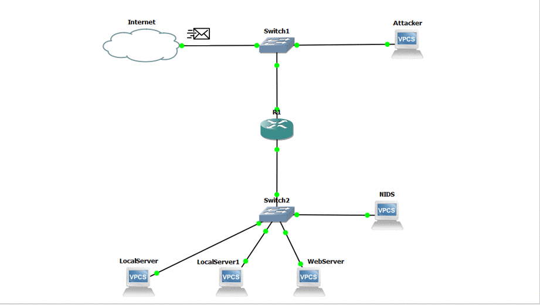

# IDS_Project
Intrusion detection system
This is a learning project to understand how to create a simple detction system using java and the understanding varies tools
such as jnetpcap, intellij, apache and virtual machine.
The system’s primary function is to continually scan its network for any suspicious activity and send a notification to a system administrator when any unusual activity is happening in the network.

# Technology
* JDK
* JnetPcap
* Tomcat-apache
* Virtual Box
* MySQL8

# Networking
Looking into detecting various networking attack such as DDos, Brute force and web attack

